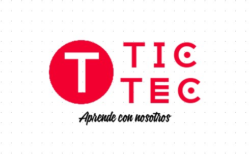
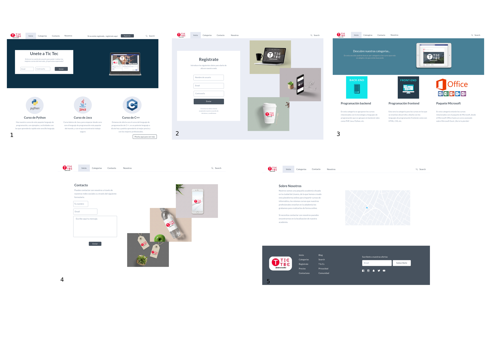

***

# Tic Tec - 2020

***

### Información

***

Este proyecto esta basado en una aplicación web creada bajo el framework
de codeigniter. En esta aplicación web esta implementada la funcionalidad
de una empresa/academia FICTICIA llamada Tic Tec, que funciona creando cursos de
programación. Los usuarios pueden tener el rol de estudiante o de profesor
, si son estudiantes podran realizar los cursos comprandolos y si eres
profesor ademas de poder realizar los cursos, puedes crear los tuyos,
una vez creado se debera comprobar por los expertos de Tic Tec.

***

#### Storyboard inicial de la aplicación web

